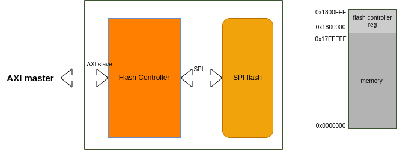

# interact with SPI flash
    与spi的最小交互单位为一个COMMAND（以下称之为命令）。每个命令由instruction phase(以下称之为指令阶段)、address phase(地址阶段)、dummy phase（dummy阶段）、data phase（数据阶段）组成。
## standard/dual/quad SPI
    standard/dual/quad SPI仅仅定义了接口的传输线的数量。不同的flash厂商对SPI有自己的规定。但大部分都遵守以下约定。
    * 指令码05H为"read status register", standard SPI传输。
    * 向SPI flash传输任何命令前（除了READ STATUS REGISTER命令），最好确认flash不处于忙状态（即Write In Process为低）。
    * 指令码03H为"read data", standard SPI传输。
    * 指令码06H为"write enable"，standard SPI传输。
    * "Dual Output Fast Read"，指令阶段、地址阶段、dummy阶段为standard SPI,数据阶段为dual SPI
    * "Quad Output Fast Read",指令阶段、地址阶段、dummy阶段为standard SPI,数据阶段为quad SPI
    * "Dual Input/Output(I/O) Fast Read",指令阶段、为standard SPI,地址阶段、dummy 阶段、数据阶段为duad SPI
    * "Qual Input/Output(I/O) Fast Read",指令阶段、为standard SPI,地址阶段、dummy 阶段、数据阶段为quad SPI

## Command reg
<!-- |           | instruction valid | instruction code|address valid|address width|addr wire width|dummy width|dummy wire width|data valid|data width|data input|data wire width|
|:----------|:-----------------:|:---------------:|:-----------:|:-----------:|:-------------:|:---------:|:----------:|:----------:|:-----------------:|:---:|:-------------:|
| Bit Field |     31            | 30:23           |22           |21:20        |19:18          |17:14      |   13:12      |11   |10:3          |2    |1:0| -->

|       |Instruction valid|Address valid|Dummy valid|Data valid|Instruction code|address length|Dummy length|Data write| Write Data length|SPI type|SPI effective phase|Reserved|
|:-----:|:-------------:|:-----------:|:---------:|:--------:|:-----:|:----:|:-------:|:------:|:------:|:------:|:------:|:-----:|
|Bit Field| 31           | 30          | 29        | 28       |27:24 | 23:22 |21:18 | 17 |16:9|8:7|6:3|2:0|
    * xxx valid 代表该阶段有效。如address valid 为0，代表这个命令没有地址阶段。 
    * address length: 00 代表地址长度为1B, 01 为2 Byte， 10 为3B，11为4B。
    * SPI type:00 代表该命令的传输为standard SPI, 01 为dual SPI， 10 为quad SPI， 11 reserved.
    * SPI effective phase: 4个bit分别指示SPI type 在四个阶段的有效性。若该阶段对应的bit 为0，则其传输方式为SPI；为1则其传输方式由SPI type指定。如SPI type== 2'b10， SPI effective phase = 4'b1000,则指令码、地址、dummy阶段都为SPI，数据阶段为Quad SPI。
    * dummy length代表dummy 传输 "dummy length"个时钟周期，4‘b0000代表无dummy phase,4'b1111代表15个时钟周期。
    * 数据阶段字节数 = data width + 1。意味着最低为一个字节，最高为256B。读数据不用配置该字段。

## Flash Controller memory map

* flash controller 从外面接收AXI传过来的交易，将其转换为SPI的COMMAND。
* 低24MB 地址为普通memory，高4KB地址为flash controller 内部寄存器。

## Flash Controller Reg Address
* R 代表该寄存器是可读的
* W 代表该寄存器是可写的
* reset val 为寄存器的复位值

|Reg Idx|Address| Reg Name | Property |Reset val| Note|
|:------|:-----:|:--------:|:--------:|:-------:|:---:|
|0      |0x1800000|Command 0 | RW     |0x81f0083c|1,2 |
|1      |0x1800004|Command 1 | RW     |0x82800804| 3  |
|2      |0x1800008|Command 2 | RW     |0x81600838| 6  |
|3      |0x180000c|Command 3 | RW     |0x00000000|    |
|4      |0x1800010|Command 4 | RW     |0x83000000|7   |
|5      |0x1800014|Command 5 | RW     |0x90600000|  8 |
|6      |0x1800018|Command 6 | RW     |0x00000000|    |
|7      |0x180001c|Command 7 | RW     |0x00000000|    |
|8      |0x1800020|addr buffer|RW     |0x00000000|  4 |
|9      |0x1800024|data buffer|RW     |0X00000000| 5  |
|10     |0X1800028|config reg |RW     |0x00000000|9   |

1. AXI master 向 Flash memory空间的读交易将触发0号寄存器中的命令。该读命令的地址阶段为AXI master发送的读交易的读地址通道中的地址。 并且命令返回的数据在AXI read transaction的读数据通道返回。由于0号寄存器的复位值为"read data"命令，因此上电后可以直接从flash读数据。用户可以更改Command 0内容。
2. 0x81f0083c为”READ DATA”命令，standard spi传输、8B的读数据,3B 地址。若用户想要自定义该寄存器中的命令，禁止数据阶段超过32B。
3. 0x82800804为“READ STATUS REGISTER" 命令，standard spi传输、1B的读数据。
4. 除了自动触发COMMAND（如向memory空间的读会触发Command 0), 其它命令的地址阶段将会使用addr buf寄存器中的值。
5. data buffer位宽为4B,从flash返回的数据会存到这里（Command 0 和 Command 1 返回的数据不会存入data buffer)。向flash发送的数据需要先存入这里（向flash program的数据不推荐放入这里，因为该寄存器仅有4B。例程中给出了如何向flash program)。 
6. 0x81600838命令为“Page Programming"命令， standard spi传输、写数据、数据8B。
7. 0x83000000命令为“Write Enable"命令， standard spi传输、无地址、dummy、数据阶段。
8. 0x90600000命令为“Sector Erase"命令， standard spi传输、3B地址、无dummy、无数据阶段。
9. 低两位为spi 模式位，只支持模式0/3。
## Flash Controller Command Trigger
    出入对Flash Controller的性能和可重用性考虑，设计了三种触发命令的方式。
* 对memory空间的读将触发Command 0(可修改Command 0 的内容）。
* 对memory空间的写将触发Command 2(可修改Command 2 的内容) 。
* 对特定REG空间的读/写将触发Command。
* RT 代表读触发， WT 代表写触发（write trigger)。

|Trigger Type|Address Arrange|Trigger Command| Note |
|:----------:|:-------------:|:-------------:|:----:|
|RT          |0x0000000-0x17fffff|Command 0| 1|
|RT          |0x1800100-0x1800103|Command 1| 2|
|WT          |0x1800104-0x1800107|Command 2| 5|
|RT          |0x1800108-0x180010b|Command 3| 3|
|WT          |0x180010c-0x180010f|Command 4|  |
|WT          |0x1800110-0x1800113|Command 5|  |
|WT          |0x1800114-0x1800117|Command 6| 3|
|WT          |0x1800118-0x180011c|Command 7| 3|

1. 读memory地址触发Command 0 ,方便快速从flash 读数据。
2. 读该地址触发Command 1（READ STATUS REG），方便快速获取flash状态。
3. 自定义。
4. 
5. 写memory地址触发Command 2,flash controller根据该命令中数据宽度data width字段向flash programming，并根据每次AXI 写交易数据宽度减少data width 字段。如该命令data width字段缺省值为8B，若本次AXI write transaction 的写数据宽度为4B，则该命令的data width字段自动变为4B，flash controller等待下一个4B的数据。
6. 推荐从flash读数据和向flash写数据都走memory空间，erase 操作和其他操作可以使用命令寄存器完成。想要实现XIP 功能可以自定义Command 0, 再从memory空间读数据。

## Flash Controller 使用例程
### read from flash
    1. 读 0x1800100，触发READ STATUS REGISTER获取flash状态。
    2. 若发现WIP为高，回到1，否则向flash controller memory发送读命令。
    3. 数据返回。
### erase flash
    1. 向 flash controller addr buffer写入相应地址。
    2. 读 0x1800100触发 READ STATUS REGISTER获取flash状态。
    3. 若发现WIP为高，回到2， 否则写0x180010c触发命令4(Write enable)。
    4. 写 0x1800110触发命令5(sector erase)。

### flash page programing
    1. 写2号寄存器，调整本次programming的size.典型值为256B（一般flash page为256B，page programming 最多支持256字节）
    2. 要写的page已擦除。
    3. 读 0x1800100，触发READ STATUS REGISTER获取flash状态。
    4. 若发现WIP为高，回到3，否则连续向memory空间写数据。数据的总宽度需要和步骤1中的size大小匹配。

